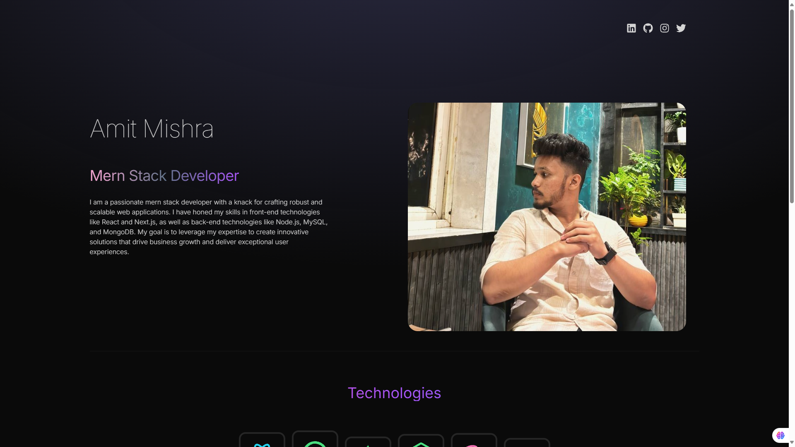

# Portfolio

Welcome to my portfolio website repository built using React! This project showcases my skills and projects in web development.

## Project Overview

This repository contains the code for my portfolio website, which includes sections for displaying projects, skills, and contact information.

### Features

- **Responsive Design**: Optimized for various screen sizes using Tailwind CSS.
- **Dynamic Background**: Implemented using CSS gradients for an engaging visual experience.
- **Modular Components**: Each section (`Navbar`, `Hero`, `Tech`, `Project`, `Contact`) is a reusable React component.
- **Animations**: Utilizes Framer Motion for smooth animations and transitions.

## Live Demo

Explore the live demo of my portfolio website: [Portfolio Demo](https://eivorr-portfolio.netlify.app/)

## Screenshots

Here are some screenshots of my portfolio:

- **Homepage**:
  

- **Projects Section**:
  

## Installation and Usage

To run the portfolio website locally:

1. Clone the repository:
   ```bash
   git clone https://github.com/your-username/portfolio.git

2.Navigate to the project directory and install dependencies:
```bash
cd portfolio
npm install


